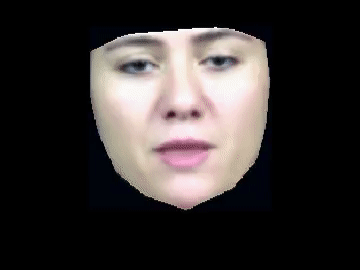
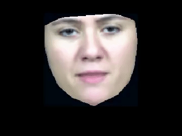
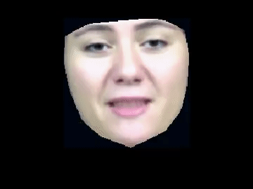
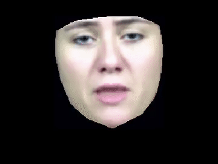

# Expressive Audio-Visual Talking head in Greek

This code accompanies the paper [Video-realistic expressive audio-visual speech synthesis for the Greek language
](https://www.sciencedirect.com/science/article/pii/S0167639317300419). You can get the preprint in [ResearchGate](https://www.researchgate.net/publication/319415357_Video-realistic_expressive_audio-visual_speech_synthesis_for_the_Greek_language).


| | |
|:-------------------------:|:-------------------------:|
|  Neutral |   Anger |
|  Happiness |  | Sadness |


## Project Structure

    .
    ├── data                   # Code to extract audio-visual features for training. Modified from [HTS](http://hts.sp.nitech.ac.jp/)
    ├── hts                    # Code to train an expressive audio-visual talking head. Modified from [HTS](http://hts.sp.nitech.ac.jp/)
    ├── merlin                 # Code to train a DNN-based expressive audio-visual talking head. Modified from [Merlin](https://github.com/CSTR-Edinburgh/merlin)
    ├── aam_model               # Code to synthesize the active appearance model from shape and texture features. 
    ├── tools                   # Tools and utilities
    ├── LICENSE
    └── README.md


### Prerequisites

* You need to download the [HTS](http://hts.sp.nitech.ac.jp/) toolkit and [SPTK](http://sp-tk.sourceforge.net/).
* HTK and [Festival](http://www.cstr.ed.ac.uk/projects/festival/) are needed only for some special features (e.g., if you want to create your own labels).
* For DNN-based synthesis you will need Theano and Python 2.7.

### Getting Started

### Installation

* Download the CVSP-EAV dataset from [here](https://pithos.okeanos.grnet.gr/public/CEko2ZrurDdUJw7SF1hRC6) and extract it. If you want to skip creating the STRAIGHT waveform features (next step) you can download them from [here]() (Warning: size is 112GB).

* Put the aam-model downloaded from the dataset (file all_emotions.mat) in the `aam_model/model/` directory.

* Download the STRAIGHT vocoder from https://github.com/HidekiKawahara/legacy_STRAIGHT.

* Compile the mex files in `aam_model/mex` needed for the facial reconstruction by calling 

```bash
make
``` 

in MATLAB.

### Feature Extraction

* In the `data/` subdirectory edit the Makefile to point to your system paths (The section you need to edit is marked with comments) and desired feature types (e.g., emotion) and outputs.
* Then, extract the mel-generalized cepstral coefficients, the pitch, and the band-aperiodicy components:

```bash
make features
```


### Training the HMM-based expressive audiovisual speech synthesis talking head
* In the `data/` subdirectory create some additional files needed for training by running:

```bash
make labels
```

* In the `hts/` subdirectory edit the configuration script `Configuration.pm` to point to your system paths (The section you need to edit is marked with comments) and configuration choices (e.g., select emotion).

* Train the HMM models:

```bash
./Training.pl Configuration.pm
```
This will take a lot of time (up to 5-6 hours) according to your system specs. If an error occurs during training, the steps up to that do not need to be repeated. You can select which training steps run from the switches in `Configuration.pm`.

* You will find the output in `hts/gen`.

### Training the DNN-based expressive audiovisual speech synthesis talking head
* Edit the `merlin/egs/greek/s1/scripts/setup.sh` to point to your system path (The section you need to edit is marked with comments) and configuration choices (e.g., select emotion).
* Train the DNN models and generate output:

```bash
./run_full_voice.sh
```

* You will find the output in `merlin/egs/greek/s1/experiments`.

### Adaptation and Interpolation
The code for HMM adaptation and interpolation is missing. Maybe I will add it at some time but it is currently not in my plans (it is old, buggy and a hassle to package).

### AAM training
Same with Adaptation and Interpolation, the code to train the AAM model from scratch is not provided. If you want the hand-labelled images and landmarks I used to train it you can e-mail. I used [AAMtools](http://cvsp.cs.ntua.gr/software/AAMtools/).

### Unit selection
The code for the unit selection part of the paper is not available (Commercial software from [Innoetics](https://www.innoetics.com/)).

## Authors

* **Panagiotis P. Filntisis** - [filby](https://github.com/filby89)

## License

This project is licensed under the MIT License - see the [LICENSE.md](LICENSE.md) file for details

## Acknowledgments
Special thanks to
* Nassos Katsamanis (https://github.com/nassosoassos) for his guidance during this project.
* George Papandreou for his code on active appearance models.
* Pyrros Tsiakoulis for his help in the unit selection part of the paper.
* Dimitra Tarousi for the recording of the CVSP-EAV database.
